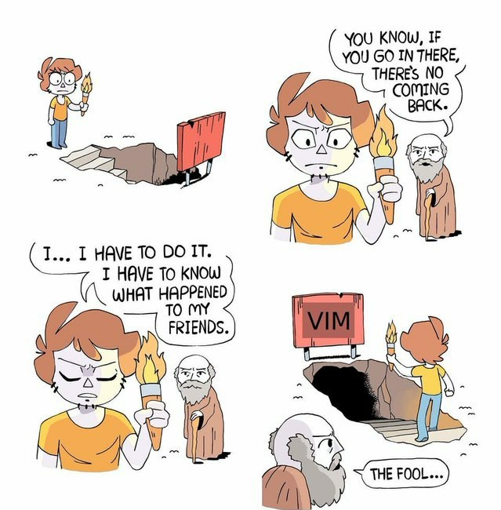

<h1 align="center">Turn the Gears On!</h1>
<p align="center"></p>

### Swordfish MODE
Configure your setup according to your needs.

- For minimalist mode:
    ```bash
    ./start_mode -m
    ```

- For customized mode:
    ```bash
    ./start_mode -c
    ```

- Download dotfiles
    ```bash
    curl --remote-name-all  https://raw.githubusercontent.com/jpwakugawa/swordfish/main/dotfiles/{.tmux.conf,.vimrc,.zshrc}
    ```

### (Custom) Nvim Folder Structure
```tree
.
├── after
│   └── plugin
│       ├── color.lua
│       ├── telescope.lua
│       └── treesitter.lua
├── init.lua
├── lua
│   └── config
│       ├── init.lua
│       ├── packer.lua
│       ├── remap.lua
│       └── set.lua

```

### Main Packages
```bash
neovim + packer
zsh + ohmyzsh
tmux
asdf
insomnia
obsidian
```

### Resources
- [Neovim From Scratch](https://www.youtube.com/watch?v=w7i4amO_zaE&list=PLm323Lc7iSW_wuxqmKx_xxNtJC_hJbQ7R&index=6)
- [Packer.Nvim](https://github.com/wbthomason/packer.nvim)
- [Telescope.Nvim](https://github.com/nvim-telescope/telescope.nvim)

